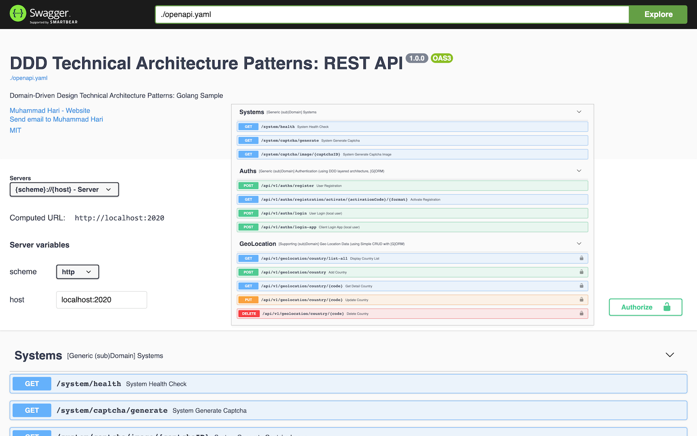

# DDD Technical Architecture Patterns: Golang

A Simple Implementation of `DDD Technical Architecture Patterms` in Go.

## Diagram v 0.2.1


### Components

A. Interface Layer (Composite Interface)

1. REST API - using Echo Framework

B. Modules:

1. Geolocation - using CRUD Architecture Pattern (GORM)
2. Authentication - using DDD Layered Architecture (GORM)
3. Email - using DDD Layered Architecture (GORM, SMTP)
4. Covid19 - using DDD Layered Architecture (Adapters -> Connectors)

C. Common System Libraries:

1. Configuration - using yaml
2. Identity & Securities - using JWT, Casbin (RBAC)
3. Email Sender - using SMTP

D. Others

1. Migrations - using GORM

E. Databases

1. MySQL (tested)
2. PostgreSQL (untested)
3. SQLServer (untested)
4. SQLite3 (untested)

F. Providers (Connectors)

1. data.covid19.go.id (Official Covid19 Website - Indonesia)
2. covid19.who.it (Official Covid19 Website - WHO)

G. Persistent Caches

1. Session/Token/JWT Cache (Redis, File, DB, etc) [tested: Redis]
2. Search Cache (ElasticSearch) [to-do]

H. Messaging [to-do]

I. Logs [to-do]

### Development

1. Clone

```shell
$ git clone https://github.com/muharihar/d3ta-go.git
```

2. Setup

```
a. copy `conf/config-sample.yaml` to `conf/config.yaml`

b. setup your dependencies/requirements (e.g: database, redis, smtp, etc.)
```

3. Development

```shell
$ cd d3ta-go
$ go run main.go db migrate
$ go run main.go server restapi
```

4. Build

```shell
$ cd d3ta-go
$ go build
$ ./d3ta-go db migrate
$ ./d3ta-go server restapi
```

5. Distribution [to-do]

```shell
$ cd d3ta-go
$ sh dist.sh
```

Pic: REST Server is running!


Swagger UI URL Address: http://localhost:2020/openapi/docs/index.html



5. Postman [to-do]

### References:

1. [Book] Domain-Driven Design: Tackling Complexity in the Heart of Software 1st Edition (Eric Evans, 2004)
2. [Book] Patterns, Principles, and Practices of Domain-Driven Design (Scott Millett & Nick Tune, 2015)

### Team & Maintainer:

1. Muhammad Hari (https://www.linkedin.com/in/muharihar/)
